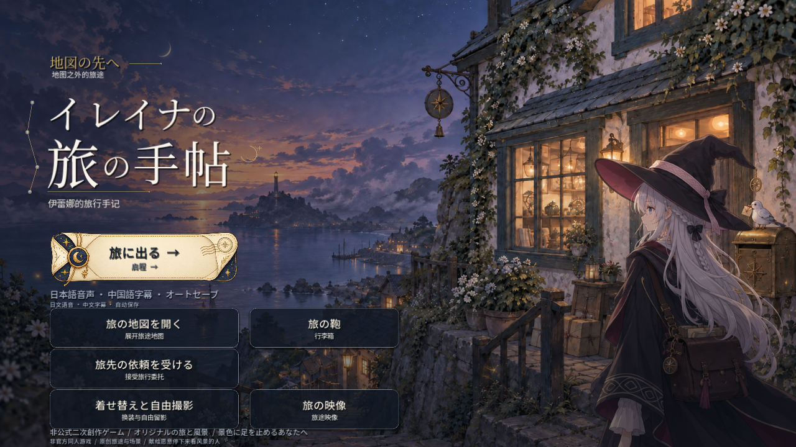

# Elaina’s Travel Journal · Uncharted Horizons

[简体中文](README.md) | English | [日本語](README.ja.md)

Chinese title: **伊蕾娜的旅行手记 · 未标注的远方**

**For those who love Elaina—and love to travel.**

An unofficial fan-made travel game starring Elaina from *Wandering Witch: The Journey of Elaina* (《魔女之旅》). Stop in unfamiliar towns, listen to their stories, solve small mysteries along the way, then climb onto your broom and head somewhere your map has yet to mark.

There is lighthearted conversation, Elaina’s wry inner commentary, and stories about parting and loss. The journey follows what she sees and the choices she makes; it does not include a romance involving Elaina.

**Windows / Android · Offline single-player · Synthesized Japanese narration + Chinese subtitles · Free to play**

**Language note:** This English README is a guide to the game. The in-game interface uses Japanese with smaller Chinese text; story subtitles are Chinese, and narration is synthesized Japanese. The game does not offer English subtitles.

[Download the game](https://github.com/elaina5201314qaq-max/elaina-travelogue/releases/latest) · [Installation](#installation-and-getting-started) · [Controls](#controls) · [Report an issue](https://github.com/elaina5201314qaq-max/elaina-travelogue/issues)

## What you can experience

- **Six journeys with branching endings:** Explore different places, talk to the people you meet, make choices, and collect small discoveries along the way.
- **An extended side story, “The Still-Damp Red Umbrella and the Track Sweeper” (《未干的红伞与扫轨人》):** Get to know people through time spent together and return visits. Chapters you have read can be revisited.
- **Japanese and Chinese presentation:** The interface uses large Japanese text with smaller Chinese text. The story has synthesized Japanese narration and Chinese subtitles, so Chinese readers can play without knowing Japanese.
- **Minigames along the way:** Broom flight, weather mixing, star-map puzzles, and small surprises hidden in scenes and conversations.
- **Outfits and free-form photos:** Switch between unlocked outfits, poses, and expressions to capture a favorite moment from the journey.
- **Five story CG sequences:** Unlock them through the story, then replay, pause, or skip them. They combine artwork with camera movement, localized motion, and environmental animation.
- **Automatic saves:** Export and import your progress. Compatible save formats can be transferred between the Windows and Android versions.

See more screenshots

These screenshots are from the Windows version. The Android version is adapted for landscape touch controls.

## Download

Go to the **[Releases page](https://github.com/elaina5201314qaq-max/elaina-travelogue/releases/latest)** and choose the file for your platform under **Assets**:

| Platform | Current game version | Download file | Basic requirements |
| --- | --- | --- | --- |
| Windows | 1.3.0 | `ElainaTravel-Windows-1.3.0.zip` | A 64-bit Windows PC |
| Android | 1.3.1 | `ElainaTravel-Android-1.3.1.apk` | Android 7.0+, 64-bit ARM64 or x86_64, and OpenGL ES 3.0 |

For Android, at least **2 GB** of free space is recommended. Both versions can be played offline after installation; no account, separate game engine, or voice model is needed.

This repository publishes the finished game and documentation only; **the game’s source code is not public**. GitHub’s automatically generated `Source code (zip)` and `Source code (tar.gz)` files are archives of this repository’s documentation. They do not contain the game. Download the ZIP or APK listed above.

The release includes `SHA256SUMS.txt`, which you can use to check the integrity of your downloaded files.

## Installation and getting started

### Windows

1. Download `ElainaTravel-Windows-1.3.0.zip`.
2. Extract the entire archive into a folder.
3. Double-click `伊蕾娜的旅行手记.exe` inside that folder and choose to begin your journey.

Extract the archive before running the game, and keep the included instructions and license files. The current EXE is not code-signed. If Windows reports an unknown publisher or source, check where you downloaded it and verify its checksum; there is no need to disable your system’s security protection.

### Android

1. Download `ElainaTravel-Android-1.3.1.apk` on your phone.
2. Open the APK in a file manager. If Android requests installation permission, enable “Install unknown apps” only for the file manager you are using.
3. Once installed, play in landscape orientation. You can turn that installation permission off afterward.

The current version has been tested in an Android 11 emulator for installation, touch controls, saves, narration, and CG playback. **It has not yet been tested on a physical Android phone.** If you encounter a compatibility problem, please include your phone model and Android version in your report.

Windows and Android versions are currently available. There are no iOS, macOS, or Linux installation packages.

## Controls

### Windows keyboard and mouse

| Action | Control |
| --- | --- |
| Advance the story | `Space` (空格) / `Enter` |
| Choose an option | Number keys or a mouse click |
| Toggle automatic playback | `A` |
| Hide / show the interface | `H` |
| Toggle fullscreen | `F11` |
| Go back | `Esc` |
| Pause / resume a CG sequence | `Space` (空格) |
| Skip a CG sequence | `Esc` |
| Adjust altitude during flight | `↑` / `↓`, `W` / `S`, or hold the mouse button and adjust your flight path |

### Android touch controls

- Tap Continue (继续) to advance dialogue. If text or choices are long, scroll vertically within the relevant area.
- Tap View the Scenery (看风景) to hide the interface, then tap the screen to restore it.
- During flight, touch and hold the screen, then drag up or down to adjust altitude.
- In photo mode, drag the character and switch between unlocked outfits, expressions, and poses.
- The system Back button closes pop-ups or returns to the previous screen.

Sound, text display, automatic reading, CG autoplay, and related settings are available in the **Travel Bag (旅の鞄 / 行李箱)**.

## Saves and photos

The game saves progress automatically. Windows saves are stored in `%APPDATA%\ElainaTravel`; Android saves are stored in the app’s own storage space.

**Before uninstalling the Android app, clearing its data, or moving to another device, export your save and keep it outside the app.** In-app backups are also deleted when the app is uninstalled or its data is cleared. The current Android version does not enable system automatic backups.

To export, open Travel Bag → Export Save (行李箱 → 导出存档). On Android, choose Copy Save Text (复制存档文字), then store the complete text outside the app. To import, open Travel Bag → Import Save (行李箱 → 导入存档), paste the complete text and validate it, then confirm that you want to replace your current progress. Saves in the same format can be transferred between the two platforms as text.

Save exports include progress and settings, but **do not include photos**. Android photos stay in the game’s own album and are not automatically saved to your phone’s system gallery.

Already playing and looking for the red umbrella side story? (Minor entry-point spoiler)

On the map, choose “The Lost-Property Shop Before Sunset” (日落前的失物商店 / 迷い町). After obtaining the ticket, go to the bench on the seaside platform and select this exact Chinese option:

> 那把红伞的气味，让我想起两个月前的潮声镇。

Meaning: “The scent of that red umbrella reminds me of Tide-Sound Town two months ago.”

The CG at the end of this side story unlocks only after you actually read through to its ending.

## Feedback and discussion

You are welcome to share your impressions, suggestions, or problems in **[Issues](https://github.com/elaina5201314qaq-max/elaina-travelogue/issues)**.

When reporting a problem, please include the game version, device and operating system version, steps that trigger the problem, and any relevant screenshots or error text. Mark story-related content as spoilers. Do not post account information or a complete save that you have not checked for private information.

## About this project

I made this game because I like Elaina, and I like to travel. I hope it gives people who share those interests a chance to spend some of their own free time accompanying her to a few more places.

This is an **unofficial fan work** based on *Wandering Witch: The Journey of Elaina* (《魔女之旅》), not an official game. Rights to Elaina and the original setting belong to their respective rights holders. The additional journeys, stories, and gameplay were created for this project.

AI tools assisted production: Codex contributed to programming, asset processing, and verification; Gemini contributed to UI design and the writing and refinement of parts of the script. Character, background, and other illustrations include generated and subsequently adjusted assets, and the Japanese narration is synthesized by a model. **The illustrations are not official character artwork, and the narration is not performed by the original cast.**

The engine, fonts, music, and sound effects are used under their respective licenses; see **[Licenses and Credits](licenses/README.md)**. This repository does not grant a general open-source license covering the game’s characters, artwork, voices, or other assets as a whole. Publicly available documentation does not mean those assets may be freely reused.
