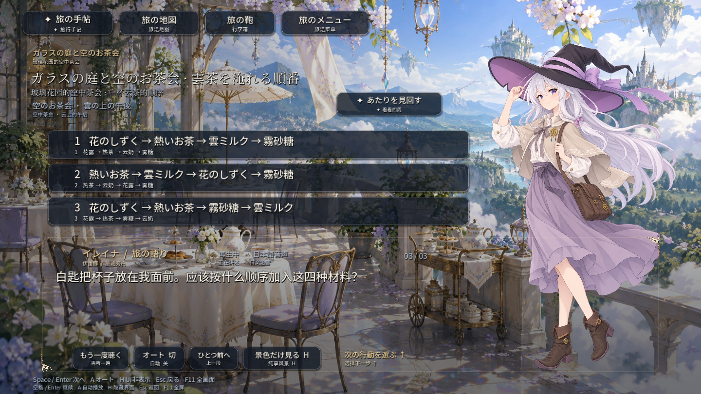
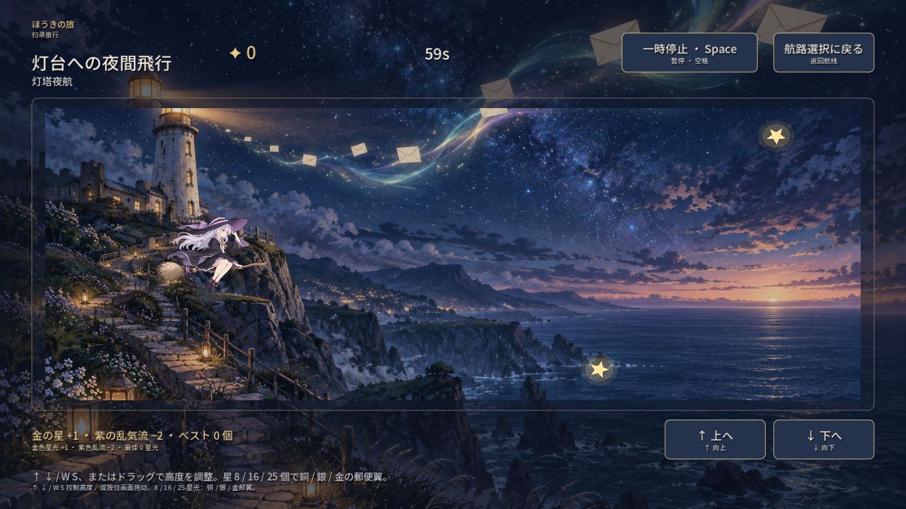

# 伊蕾娜的旅行手记 · 未标注的远方

简体中文 | [English](README.en.md) | [日本語](README.ja.md)

**给同样喜欢伊蕾娜、也喜欢旅行的你。**

一款以《魔女之旅》中的伊蕾娜为主角的非官方同人旅行游戏。在陌生的城镇停留，听几段故事，解开旅途中的小谜题，再骑上扫帚，去往地图上还没有标记的地方。

这里有轻松的闲谈、伊蕾娜的内心吐槽，也有关于离别与失去的故事。旅途围绕她的见闻与选择展开，没有安排与伊蕾娜有关的恋爱情节。

**Windows / Android · 单机离线 · 日文合成配音＋中文字幕 · 免费体验**

本仓库另有英文与日文说明文档；游戏内剧情字幕目前为中文，没有英文字幕。

[下载游戏](https://github.com/elaina5201314qaq-max/elaina-travelogue/releases/latest) · [安装方法](#安装与开始游玩) · [操作说明](#操作说明) · [反馈问题](https://github.com/elaina5201314qaq-max/elaina-travelogue/issues)

## 可以体验什么

- **六篇旅途与分支结局**：在不同地方探索、交谈、作出选择，收集沿途的小发现。
- **长支线《未干的红伞与扫轨人》**：在一段相处与回访中，慢慢了解旅途中遇见的人。已读章节可以回看。
- **日语与中文双语呈现**：界面采用日文大字、中文小字；剧情配有日文合成语音和中文字幕，不懂日语也能游玩。
- **旅行中的小游戏**：扫帚飞行、天气调配、星图拼图，以及藏在场景和对话里的小彩蛋。
- **换装与自由留影**：切换已解锁的服饰、姿势和表情，给喜欢的旅途场景留一张照片。
- **五段剧情 CG**：随剧情解锁，之后可以回放、暂停或跳过；由画稿结合镜头、局部动作与环境动画制作。
- **自动存档**：支持导出、导入进度，兼容格式的电脑与安卓存档可以互相转移。

再看两张游戏画面

以上为 Windows 版游戏画面。安卓版针对横屏触控作了适配。

## 下载

请前往 **[Releases 下载页](https://github.com/elaina5201314qaq-max/elaina-travelogue/releases/latest)**，在 Assets 中选择对应平台：

| 平台 | 当前游戏版本 | 下载文件 | 基本要求 |
| --- | --- | --- | --- |
| Windows | 1.3.0 | `ElainaTravel-Windows-1.3.0.zip` | 64 位 Windows 电脑 |
| Android | 1.3.1 | `ElainaTravel-Android-1.3.1.apk` | Android 7.0+、64 位 ARM64 或 x86_64、OpenGL ES 3.0 |

安卓建议预留至少 **2 GB** 空间。两端安装后均可离线游玩，无需账号、游戏引擎或配音模型。

这里仅发布游戏成品与说明文档，**不公开游戏源码**。GitHub 自动生成的 `Source code (zip)` / `Source code (tar.gz)` 是本仓库的文档归档，里面没有游戏，请下载上表中的 ZIP 或 APK。

发布页附有 `SHA256SUMS.txt`，可用来核对下载文件是否完整。

## 安装与开始游玩

### Windows

1. 下载 `ElainaTravel-Windows-1.3.0.zip`。
2. 将整个压缩包解压到一个文件夹。
3. 双击其中的 `伊蕾娜的旅行手记.exe`，选择开始旅行。

请先解压再运行，并保留同包的安装说明和许可文件。当前 EXE 没有代码签名；若系统提示来源未知，请核对下载来源与文件校验值，不必关闭系统安全防护。

### Android

1. 在手机上下载 `ElainaTravel-Android-1.3.1.apk`。
2. 用文件管理器打开 APK。如果系统要求安装权限，仅为当前使用的文件管理器开启「安装未知应用」。
3. 完成安装后横屏游玩；安装权限用完可以关闭。

当前版本已在 Android 11 模拟器上做过安装、触控、存档、配音和 CG 验证，**尚未经过实体安卓手机测试**。遇到兼容性问题，欢迎反馈手机型号和系统版本。

目前提供 Windows 与 Android 版本，没有 iOS、macOS 或 Linux 安装包。

## 操作说明

### Windows 键鼠

| 操作 | 按键 |
| --- | --- |
| 推进剧情 | `空格` / `Enter` |
| 选择选项 | 数字键或鼠标点击 |
| 切换自动播放 | `A` |
| 隐藏 / 显示界面 | `H` |
| 切换全屏 | `F11` |
| 返回 | `Esc` |
| CG 暂停 / 继续 | `空格` |
| 跳过 CG | `Esc` |
| 飞行时控制高度 | `↑` / `↓`、`W` / `S`，或按住鼠标调整航道 |

### 安卓触控

- 点击「继续」推进对话；文字或选项较长时，在对应区域上下滑动。
- 点击「看风景」隐藏界面，轻触画面恢复。
- 飞行时按住屏幕，上下拖动控制高度。
- 留影时可以拖动人物，切换已解锁的服饰、表情和姿势。
- 系统返回键可关闭弹窗或返回上一层。

声音、文字显示、自动阅读和 CG 自动播放等选项可以在 **「旅の鞄 / 行李箱」** 中调整。

## 存档与照片

游戏会自动保存进度。Windows 存档位于 `%APPDATA%\ElainaTravel`，安卓存档保存在应用自己的存储空间中。

**安卓卸载、清除数据或换机前，请先把存档导出到应用外。** 应用内备份也会随卸载或清除数据一起删除，当前安卓版本未启用系统自动备份。

导出时打开「行李箱 → 导出存档」，在安卓端选择「复制存档文字」，将完整内容保存到应用之外。导入时打开「行李箱 → 导入存档」，粘贴完整文字并校验，再确认替换当前进度。两端可用相同格式的存档文字转移进度。

存档导出包含进度和设置，**不包含留影图片**。安卓留影保存在游戏自己的相册中，不会自动写入手机系统相册。

已经在玩，想找到红伞长支线？（轻微入口提示）

在地图选择「日落前的失物商店」（迷い町），取得车票后前往海边月台的长椅，选择：

> 那把红伞的气味，让我想起两个月前的潮声镇。

支线结尾的 CG 需要实际读到结尾才会解锁。

## 反馈与交流

欢迎在 **[Issues](https://github.com/elaina5201314qaq-max/elaina-travelogue/issues)** 留下游玩感受、改进建议或遇到的问题。

报告问题时，尽量附上游戏版本、设备与系统版本、触发问题的步骤，以及相关截图或报错文字。涉及剧情的内容请标注「剧透」；公开反馈中不要附上账号信息或未经检查的完整存档。

## 关于这个项目

做这个游戏，是因为我喜欢伊蕾娜，也喜欢旅行。希望它能让有同样爱好的人，在一段属于自己的空闲时间里，再陪她走过几个地方。

本作是《魔女之旅》的 **非官方同人作品**，并非原作官方游戏；伊蕾娜及原作相关设定的权利归相应权利人。新增旅途、故事和玩法为本项目创作。

制作过程中使用了 AI 辅助：Codex 参与程序实现、资源处理与验证，Gemini 参与 UI 设计和部分剧本创作与润色。人物、场景等插画包含生成与后续调整的素材，日文配音为模型合成，**不是官方立绘，也不是原作声优演出**。

引擎、字体、音乐和音效按各自许可使用，详见 **[许可与鸣谢](licenses/README.md)**。本仓库没有为游戏角色、美术、配音等整体授予通用开源许可；文档可见不代表这些素材可以任意再利用。
